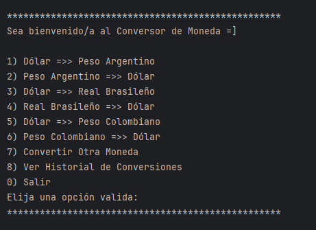
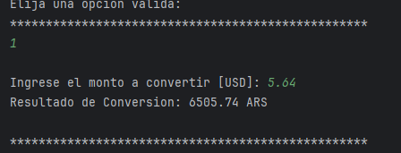
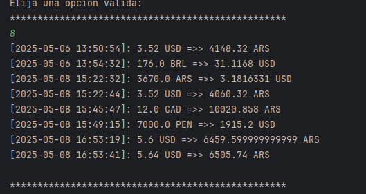

# 💱 Conversor Challenge

Aplicación de consola desarrollada en Java que permite realizar conversiones entre diferentes monedas utilizando la API pública de [ExchangeRate-API](https://www.exchangerate-api.com/). El sistema también permite generar y consultar un historial de conversiones.

---

## 🖼️ Capturas de pantalla

### Menú principal de la aplicación


### Conversión de monedas en tiempo real


### Historial con fecha y hora


---

## 🧾 Características

- Consulta en tiempo real de tasas de cambio entre monedas.
- Conversión de montos entre diferentes divisas.
- Visualización de todas las monedas soportadas por la API.
- Generación de historial de conversiones (con fecha y hora).
- Organización del proyecto en múltiples capas (Main, lógica de negocio, acceso a datos, modelos).
- Uso de buenas prácticas con Git y GitHub (ramas feature, develop, main).

---

## 📂 Estructura del Proyecto

```bash
conversor-challenge/
│
├── src/
│   ├── Main.java                # Clase principal con el menú de opciones
│   │
│   ├── models/                  # Definición de modelos de datos
│   │   └── Moneda.java
│   │
│   ├── functions/               # Lógica de negocio y operaciones
│   │   └── Conversor.java
│   │
│   ├── api_consume/             # Operaciones del Cliente (Peticiones y Manejo de Respuestas)
│   │   └── Consultas.java
│   │
│   ├── resources/               # Archivos generados
│   │   └── historial.json
│   │
│   └── utils/                   # Utilidades como lectura/escritura de archivos
│       └── GeneradorArchivo.java
│
├── assets/                      # Imágenes del README
│   ├── menu-principal.png
│   ├── conversion.png
│   └── historial.png
│
└── README.md
````

---

## 📌 Tecnologías utilizadas

* **Lenguaje:** Java 17+
* **Librerías:**

    * `java.net.http.HttpClient` (consultas HTTP)
    * `com.google.gson.Gson` (parseo de JSON)
    * `java.time.LocalDateTime` (fecha y hora)
* **Gestión de dependencias:** Manual
* **Herramienta de desarrollo:** IntelliJ IDEA

---

## ▶️ Instrucciones de uso

1. **Clonar el repositorio**

   ```bash
   git clone https://github.com/lucas29951/conversor-challenge.git
   ```

2. **Abrir el proyecto en tu IDE de preferencia**

3. **Ejecutar la clase `Main.java`** que se encuentra en el paquete `app`.

---

## 🔎 Opciones disponibles en el menú

1. **Realizar una conversión**
2. **Mostrar historial de conversiones**
3. **Mostrar monedas soportadas por la API**
4. **Generar archivo de historial**
5. **Salir del programa**

---

## 🧠 Organización del desarrollo

* Ramas principales:

    * `main`: versión estable del proyecto.
    * `develop`: rama de integración de características.
* Ramas feature creadas:

    * `feature/api-consulta`: manejo de peticiones a la API.
    * `feature/conversor`: lógica de conversión.
    * `feature/historial`: registro de conversiones con fecha/hora.
    * `feature/nuevas-monedas`: consulta de monedas soportadas.

---

## 📘 Licencia

Este proyecto es de código abierto y se encuentra bajo la licencia MIT.

---

## 🙌 Autor

**[Lucas Rodriguez](https://github.com/lucas29951)**
Proyecto desarrollado como parte del desafío educativo y práctico para mejorar habilidades en Java, API REST, y control de versiones.

